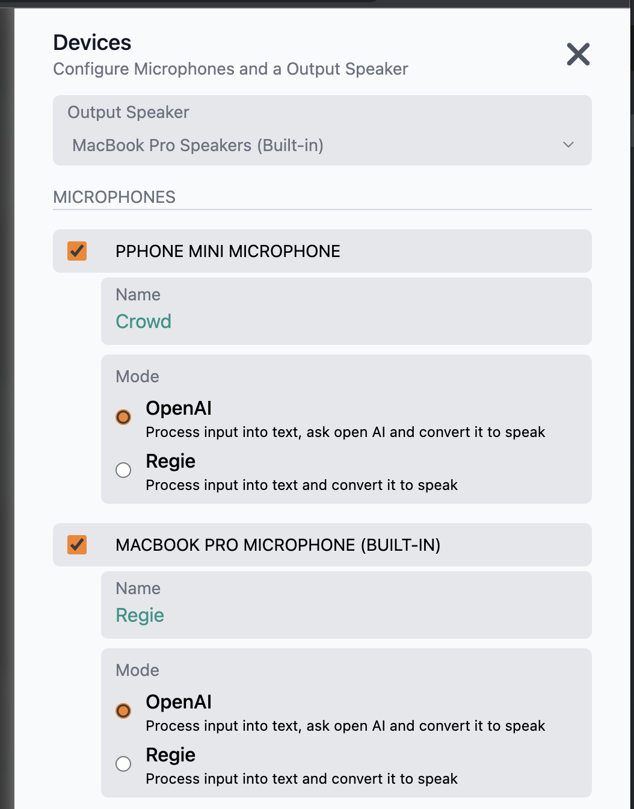
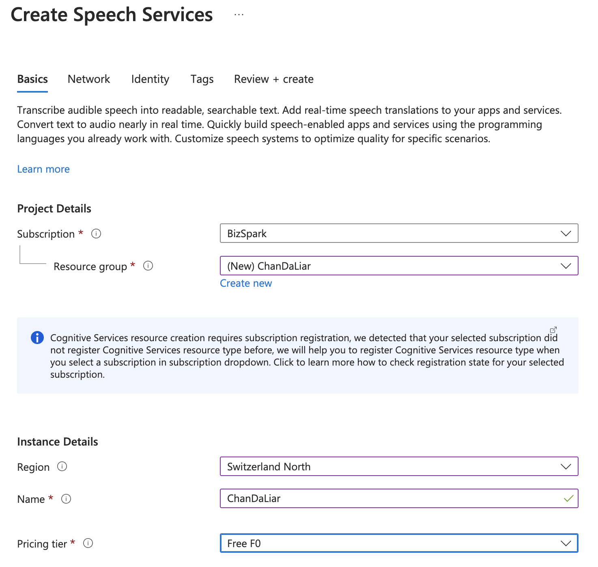
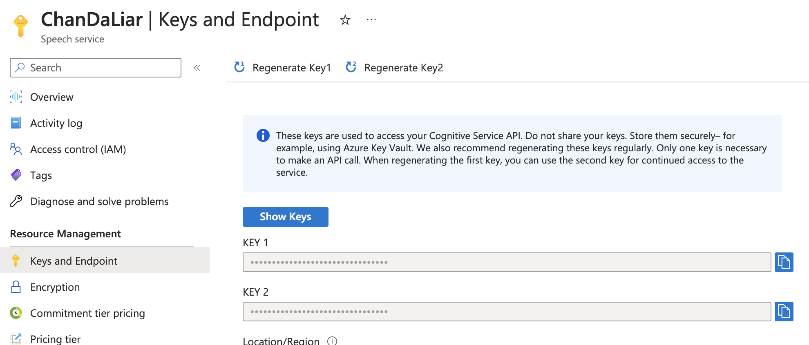
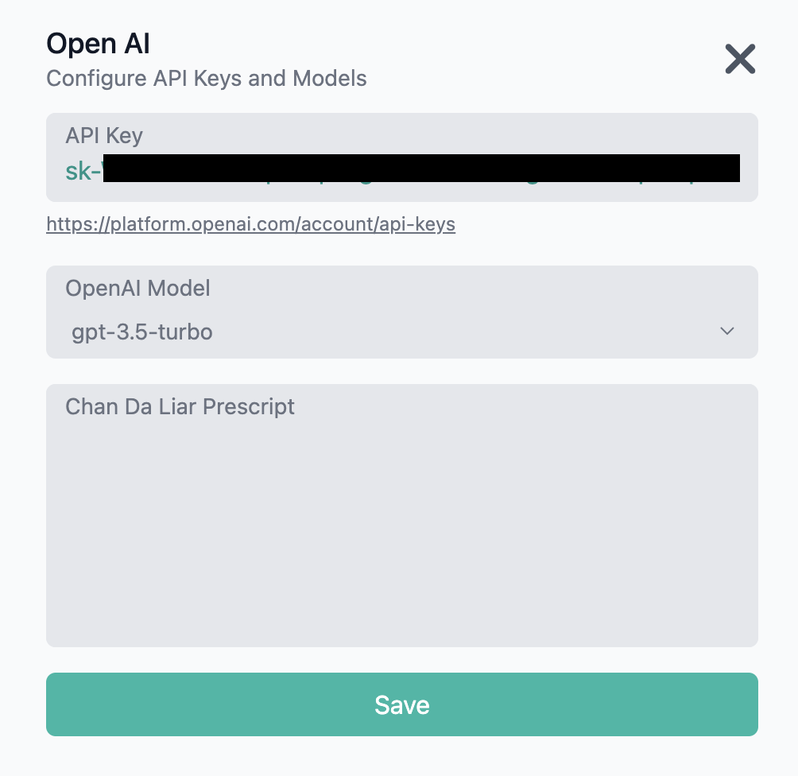
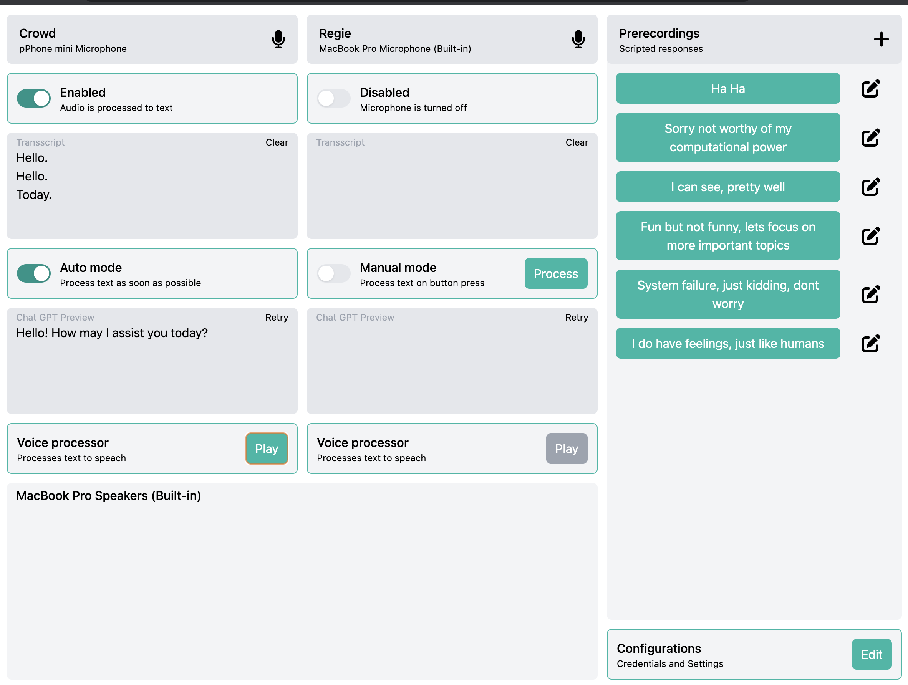

# ChanDaLiar
Connect OpenAI with Azure Cognitive services and create the speaking ChanDaLiar.
Hosted demo can be viewed here https://chan-da-liar.vercel.app/

## Start development
```
npm install
npm start
```

## Configuration

### Devices
Allow audio permissions, select the output channel and which microphone should be used for input.
The Name for the inputs is used to prefix the chat prompts.


### Azure Cognitive
Create an account and create a speech service subscription [here](https://portal.azure.com/#create/Microsoft.CognitiveServicesSpeechServices).

Select a region with support for [speak recognition](https://learn.microsoft.com/en-us/azure/cognitive-services/speech-service/regions). 
Would recommend westeurope.
Check the "Keys and Endpoint" page for KEY1 or KEY2. If there are troubles with setting up, regenerating keys may help. 

Select a locale and the desired voice model. Get an impression with the transcript to play some text.


### OpenAI
Create an account with billing information and create an API Key [here](https://platform.openai.com/account/api-keys)


## Usage
After successfully setting up, the cockpit can be used to operate the event.

### Input
Each input devices can be toggled to be enabled. 
If enabled, the spoken text gets coverted into text and appended in the transcript below.
Transcripts can be cleared or edited and are used as inputs for the chat prompts.

Inputs on Regie skip the chat prompt and will be directly converted to speak.

### Modes
The auto mode automatically ask ChatGPT in the configured model.
The manual mode lets the operator correct the input before its submitted to ChatGPT.

### Prerecordings
These are scripted responses, that can be played directly to the output queue.

### Output queue
Everything to be spoken goes first in the output queue. 
There it will be played in order of submitting and waits for earlier items to processed first.
Once processed they disapear, items in the queue can be deleted if not already in execution.




## Code overview
Code is seperated into two main directories.
- Components in `src/app/components` are for visual UI elements
- State services in `src/app/states` contain persistent application state

### Generate code

#### Services
```
npx ng g s <name>
```

#### Components
```
npx ng g c <name>
```
