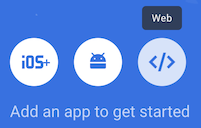

# ChanDaLiar

Connect OpenAI with Azure Cognitive services and create the speaking ChanDaLiar.
Hosted demo can be viewed here https://chan-da-liar.vercel.app/

## Start development

Tested with node v18.11.0

```
npm install
npm start
```

## Configuration

### Devices

Allow audio permissions, select the output channel and which microphone should be used for input.
The Name for the inputs is used to prefix the chat prompts.


### Azure Cognitive

Create an account and create a speech service subscription [here](https://portal.azure.com/#create/Microsoft.CognitiveServicesSpeechServices).

Select a region with support for [speak recognition](https://learn.microsoft.com/en-us/azure/cognitive-services/speech-service/regions). 
Would recommend westeurope.
Check the "Keys and Endpoint" page for KEY1 or KEY2. If there are troubles with setting up, regenerating keys may help. 

Select a locale and the desired voice model. Get an impression with the transcript to play some text.


### OpenAI

Create an account with billing information and create an API Key [here](https://platform.openai.com/account/api-keys)


### Firebase

Firebase is an online database that can be used to manage user data without a dedicated server setup (i.e. everything other than the firebase runs in the frontend in the browser).

In this project, the database keeps a transcript of conversations and accrued cost, as well as API keys for Azure and OpenAI. Note though that the firebase setup is optional. Users can use the app without logging in, but in that case they have to specify Azure and OpenAI keys manually.

For setting up the database, it is sufficient to:

1. Create firebase project (free of charge): go to  https://console.firebase.google.com/ and click on "add project".

2. We want the database functionality: in the project overview page,  click on "Firestore" (either click on the card in the main view, or click on the "Build" menu item and then "Firestore Database") and then "Create Database". When asked, you can click on "Start in production mode" since we're going to update these rules below. As for the location, best to choose your own continent.

3. Now we want to make sure that every user can only access their own data under the `/users/{userId}` path. To achieve this, in the "Cloud Firestore" page, click on the "rules" tab and enter the following text (and then click "Publish"):

    ```
    rules_version = '2';
    service cloud.firestore {
      match /databases/{database}/documents {
        match /users/{userId}/{document=**} {
          allow read, write: if request.auth != null && request.auth.uid == userId;
        }
        match /{document=**} {
          allow read, write: if false;
        }
      }
    }
    ```

4. For adding users, we go back on the project overview page, and then select "Authentication" (the page is also reachable from the left hand menu under "Build" or "Engage"). After clicking on "Get started" (or similar), you'll get on the main authentication page where you can go to the "Sign-in method" and then "Add new provider", and choose "Email/Password". Then go back to the "Users" tab and add a user manually. Make sure to copy the "User UID" because we need it in the next step.

5. We can then go back to the "Firestore Database", and then click on "Start collection" called "users". Still in the same dialog, enter the "User UID" value from last step as the "Document ID" and then click "Save".

6. Finally, we click again again on "Start collection" *inside* this new added document, and then enter "info" as "Collection ID", and then enter "config" as the "Document ID", and the fields `openaiApiKey`, `azureRegion`, `azureApiKey` that contain the OpenAI API key, and Azure region and API key.

7. Now we need to set up an application for the database. Go back to the project overview page and click on

  

8. We don't need hosting or anything else, simply click "Next".

9. Then in the "Project settings" page you'll find the "Web API Key" and "App ID".

10. Going back to the chan-da-liar web app, go to the "Firebase" configuration and then click on "Show advanced settings" to update the "API Key" and "App ID" (that's the "Web API Key" and "App ID" from last step) - the default values are stored in [`./app/states/firebase.service.ts`]. Then you can log in with the email/password registered in the Firestore UI.

11. You can then log in by providing an Email/password previously registered (see above point about "adding users").

## Usage

After successfully setting up, the cockpit can be used to operate the event.

### Input

Each input devices can be toggled to be enabled. 
If enabled, the spoken text gets coverted into text and appended in the transcript below.
Transcripts can be cleared or edited and are used as inputs for the chat prompts.

Inputs on Regie skip the chat prompt and will be directly converted to speak.

### Modes

The auto mode automatically ask ChatGPT in the configured model.
The manual mode lets the operator correct the input before its submitted to ChatGPT.

### Prerecordings

These are scripted responses, that can be played directly to the output queue.

### Output queue

Everything to be spoken goes first in the output queue. 
There it will be played in order of submitting and waits for earlier items to processed first.
Once processed they disapear, items in the queue can be deleted if not already in execution.


### Roadmap

- [ ] Spoken text gets picked up from microphone and ends up in the input. Pause microphones on play may help or if the speak recognization detects the speaker voice.
- [ ] Improve OpenAI conversation
  - [ ] Role play prompt currently ignored
  - [ ] visualize current conversation
  - [ ] reset for conversation / clear single items

## Code overview

Code is seperated into two main directories.
- Components in `src/app/components` are for visual UI elements. You can add a new component via the [Angular client](https://angular.io/cli)'s `npx ng generate component`.
- State services in `src/app/states` contain persistent application state. You can add a new service via the [Angular client](https://angular.io/cli)'s `npx ng generate service`.
